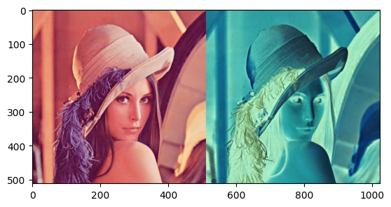
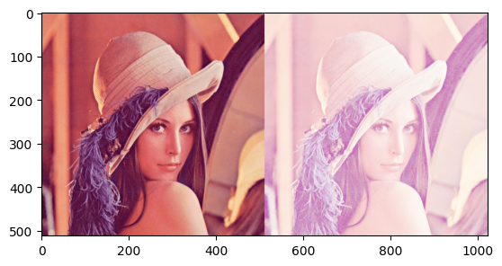

# Image processing basics
Welcome, This repo aims to give a better understanding about image processing

## contents

1. [Negative filter](https://github.com/fayis672/image_processing-basics/tree/main/image_filters/negative) <br/>
The negative of an image with gray levels in the range [0, L-1] is
obtained by using the negative transformation, which is given by the
expression <br/>
``` s = L - 1 - r ``` <br/>
Reversing the intensity levels of an image in this manner produces the equivalent of a
photographic negative. This type of processing is particularly suited for enhancing white
or gray detail embedded in dark regions of an image, especially when the black areas are
dominant in size.<br/>

2. [Log transform](https://github.com/fayis672/image_processing-basics/tree/main/image_filters/log_transfrom) <br/>
The general form of the log transformation is: <br/>
``` S = c log(1+r) ``` </br>
where c is a constant, and it is assumed that r ≥ 0.This transformation maps a narrow range of low gray-level values in the input
image into a wider range of output levels. The opposite is true of higher values of input
levels. We would use a transformation of this type to expand the values of dark pixels in
an image while compressing the higher-level values. The opposite is true of the inverse
log transformation.

2. [Power law transform](https://github.com/fayis672/image_processing-basics/tree/main/image_filters/power_law_transform) <br/>
Power-law transformations have the basic form: <br/>
``` S = c r^γ ``` </br>
Where c and γ are positive constants.As
in the case of the log transformation, power-law curves with fractional values of γ map a
narrow range of dark input values into a wider range of output values, with the opposite
being true for higher values of input levels

